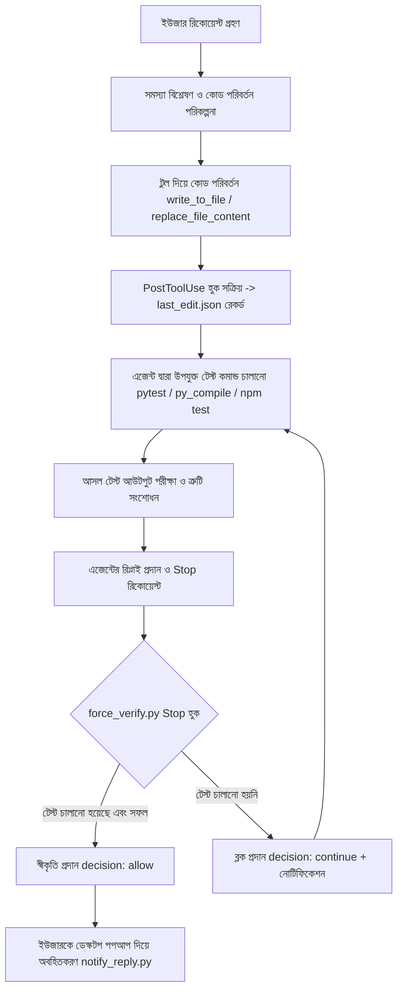

# Google Antigravity (AGY) Lifecycle Hooks & Enforcement Architecture Guide

> **লক্ষ্য:** প্রম্পট-ভিত্তিক নির্দেশনা (`AGENTS.md`/`GEMINI.md`) এর পাশাপাশি শেল-লেভেল ডিটারমিনিস্টিক গেট (`hooks.json`) ব্যবহার করে এজেন্টের প্রতিটি কোড পরিবর্তনের পর বাস্তব টেস্ট ও ভেরিফিকেশন নিশ্চিত করা।

---

## ১. ভূমিকা: Instruction Layer বনাম Enforcement Gate

AI কোডিং এজেন্টের ক্ষেত্রে সবচেয়ে বড় চ্যালেঞ্জ হলো **অকাল সমাপ্তি (Premature Completion)** এবং **ভুল দাবি (Hallucinated Claims)**:
- `AGENTS.md` বা `GEMINI.md` হলো **Instruction (নির্দেশিকা)**। মডেল এটি পড়ার পরও মাঝে মাঝে টেস্ট না চালিয়েই বলে দিতে পারে: *"All tests passed, implementation completed successfully."*
- `hooks.json` এবং এক্সিকিউটেবল ইন্টারসেপ্টর স্ক্রিপ্টসমূহ হলো **Deterministic Enforcement Layer (প্রশাসনিক প্রতিরোধ প্রাচীর)**। এটি এজেন্টের প্রম্পট বা ইচ্ছার ওপর নির্ভর করে না; Antigravity Engine যখনই টার্ন সমাপ্ত করতে যায়, ইন্টারসেপ্টর স্ক্রিপ্ট স্বয়ংক্রিয়ভাবে ট্রানস্ক্রিপ্ট ও প্রমাণ ফাইল পরীক্ষা করে এজেন্টের প্রস্থান আটকে দেয়।

---

## ২. Antigravity Hook Architecture ও JSON Contract

Google Antigravity (AGY) এর লাইফসাইকেল হুক্স ফ্রেমওয়ার্ক ইউনিক্স ব্যাশ এক্সিট কোডের (`exit 2`) চেয়ে অনেক বেশি আধুনিক ও শক্তিশালী। এটি **স্ট্যান্ডার্ড ইনপুট (`stdin`) এবং স্ট্যান্ডার্ড আউটপুট (`stdout`) ভিত্তিক JSON Contract** মেনে চলে (সব কি-তে camelCase ব্যবহৃত হয়)।

### সমর্থিত মূল লাইফসাইকেল ইভেন্টস:

| ইভেন্ট | কখন ফায়ার করে | উদ্দেশ্য | ইনপুট / আউটপুট ফরম্যাট |
| :--- | :--- | :--- | :--- |
| **`Stop`** | এজেন্ট যখন টার্ন শেষ করে থামতে যায় (`model_stop`) | কমপ্লিশন গেট — টেস্ট ছাড়া কাজ শেষ ঘোষণা করা আটকানো | **ইনপুট:** `terminationReason`, `transcriptPath`, `workspacePaths`<br>**আউটপুট:** `{"decision": "continue", "reason": "..."}` অথবা `{"decision": "allow"}` |
| **`PostToolUse`** | কোনো নির্দিষ্ট টুল এক্সিকিউট হওয়ার পর | কোড পরিবর্তনের তথ্য বা এভিডেন্স রেকর্ড করা | **ইনপুট:** `stepIdx`, `workspacePaths`, `error`<br>**আউটপুট:** `{}` (খালি JSON অবজেক্ট) |
| **`PreToolUse`** | কোনো টুল চলার ঠিক পূর্বে | টুল কল ব্লক করা, স্যানিটাইজ করা বা ইউজারের অনুমতি চাওয়া | **ইনপুট:** `toolCall` (name, args)<br>**আউটপুট:** `{"decision": "allow"\|"deny"\|"force_ask"}` |

---

## ৩. আমাদের বাস্তবায়িত গেট সিস্টেম (Implementation Breakdown)

### ১. `hooks.json` কনফিগারেশন:

```json
{
  "reply-notifier": {
    "Stop": [
      {
        "type": "command",
        "command": "python C:\\Users\\Irak\\.gemini\\config\\notify_reply.py",
        "timeout": 15
      }
    ]
  },
  "verification-gate": {
    "PostToolUse": [
      {
        "matcher": "write_to_file|replace_file_content",
        "hooks": [
          {
            "type": "command",
            "command": "python C:\\Users\\Irak\\.gemini\\config\\record_tool_edit.py",
            "timeout": 15
          }
        ]
      }
    ],
    "Stop": [
      {
        "type": "command",
        "command": "python C:\\Users\\Irak\\.gemini\\config\\force_verify.py",
        "timeout": 30
      }
    ]
  }
}
```

### ২. `record_tool_edit.py` (PostToolUse Hook):
- এজেন্ট যখনই `write_to_file` বা `replace_file_content` ব্যবহার করে কোনো ফাইলে পরিবর্তন আনে, ইঞ্জিন সাথে সাথে এই স্ক্রিপ্ট চালায়।
- স্ক্রিপ্টটি সংশ্লিষ্ট ওয়ার্কস্পেসের `.agy_evidence/last_edit.json` ফাইলে টাইমস্ট্যাম্প এবং `pending_verification = True` ফ্ল্যাগ লিখে রাখে।
- এটি এজেন্টের অগোচরেই নিশ্চিত করে যে এই টার্নে কোড মডিফাই করা হয়েছে।

### ৩. `force_verify.py` (Stop Hook):
এজেন্ট যখনই তার উত্তর শেষ করে টার্মিনালে কন্ট্রোল ফেরত দিতে যায় (`terminationReason == "model_stop"`), এই স্ক্রিপ্ট সক্রিয় হয়:
1. **ওয়ার্কস্পেস কাস্টম ভেরিফিকেশন চেক:** প্রজেক্টের ভেতরে `.agents/scripts/force_verify.py` (বা `.bat` / `.ps1`) থাকলে প্রথমে তা রান করা হয়। ব্যর্থ হলে সাথে সাথে টার্ন আটকে দেওয়া হয়।
2. **ট্রানস্ক্রিপ্ট অডিট:** বর্তমান টার্নের শুরু থেকে ট্রানস্ক্রিপ্ট অ্যানালাইজ করা হয়। যদি কোনো কোড এডিট টুল কল করা হয়ে থাকে, তবে সেই এডিটের পর কোনো টেস্ট কমান্ড (`pytest`, `unittest`, `py_compile`, `npm test`, `jest`, `cargo test`, ইত্যাদি) চালানো হয়েছে কিনা তা যাচাই করা হয়।
3. **এভিডেন্স চেক:** টেস্ট চালানো হলেও টেস্ট সফলভাবে পাস হয়েছে কিনা (Exit Code 0) তা পরীক্ষা করা হয়।
4. **বাস্তব ইন্টারসেপশন:** যদি কোড এডিট থাকে কিন্তু টেস্ট না চালানো হয়, স্ক্রিপ্ট আউটপুট দেয়:
   ```json
   {
     "decision": "continue",
     "reason": "🛑 কঠোর ভেরিফিকেশন প্রোটোকল: এই টার্নে কোড পরিবর্তন করা হয়েছে কিন্তু কোনো টেস্ট বা ভেরিফিকেশন কমান্ড চালানো হয়নি। 'কাজ শেষ' বলার পূর্বে সংশ্লিষ্ট টেস্ট চালান এবং ফলাফল প্রমাণ করুন।"
   }
   ```
   **ফলস্বরূপ:** ইঞ্জিন স্বয়ংক্রিয়ভাবে এজেন্টের প্রস্থান বাতিল করে, এবং এই `reason` বার্তাটি এজেন্টের কাছে নতুন হাই-প্রায়োরিটি প্রম্পট হিসেবে পাঠিয়ে দেয়। এজেন্টের আর কোনো উপায় থাকে না টেস্ট না চালিয়ে বের হওয়ার!
5. **অ্যান্টি-ডেডলক গার্ড:** কোনো কারণে যদি এজেন্ট পরপর ৩ বার আটকে যায়, সিস্টেম ইনফিনিট লুপ এড়াতে পরবর্তী ধাপে কন্ট্রোল দিয়ে দেয়।

---

## ৪. এজেন্ট কীভাবে এই সিস্টেম ব্যবহার করে সফল হবে (Agent Workflow)

এই এনফোর্সমেন্ট আর্কিটেকচারে সফল হতে এজেন্টকে অবশ্যই নিচের ধাপসমূহ অনুসরণ করতে হবে:



---

## ৫. প্রজেক্ট-লেভেলে নিজস্ব কাস্টম টেস্ট যুক্ত করার নিয়ম

যদি আপনার কোনো প্রজেক্টে বিশেষ টেস্ট বা লিন্টার স্যুট থাকে যা প্রতিটি পরিবর্তনের পর অবশ্যই পাস করতে হবে, তবে সেই প্রজেক্ট ফোল্ডারে শুধু নিচের স্ক্রিপ্টটি তৈরি করে রাখুন:

`.agents/scripts/force_verify.bat` (অথবা `.py` / `.ps1`):
```cmd
@echo off
rem আপনার প্রজেক্টের নির্দিষ্ট টেস্ট রান করুন
npm test
if %ERRORLEVEL% neq 0 (
    echo [ERROR] প্রজেক্ট টেস্ট ফেইল করেছে!
    exit /b 1
)
exit /b 0
```
`force_verify.py` গ্লোবাল হুক স্বয়ংক্রিয়ভাবে প্রজেক্টের এই স্ক্রিপ্টটিকে ডিটেক্ট করবে এবং সফল না হওয়া পর্যন্ত এজেন্টকে টার্ন শেষ করতে দেবে না।
